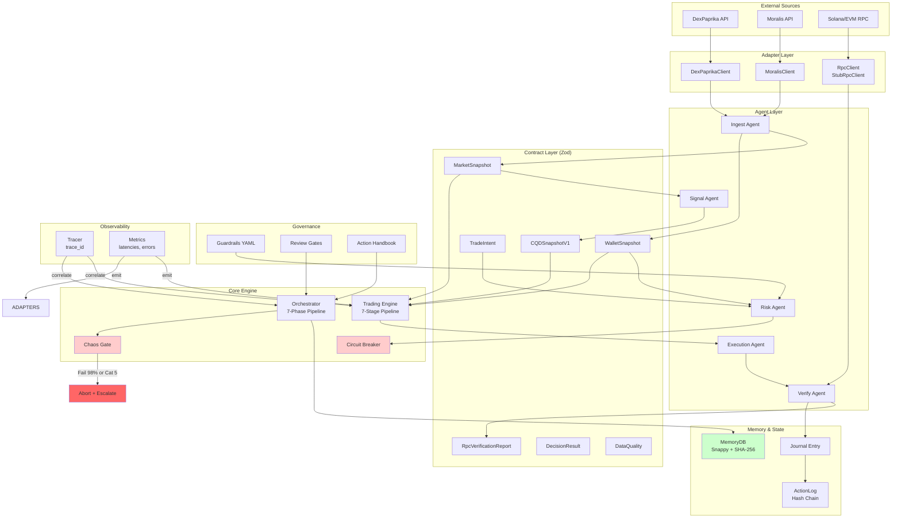

> **Scope note:** This is the KIMI SWARM repository audit (2026-03-05), scoped to TS engine adapters, contracts, and early gap analysis.
> For the current live-readiness audit, see [`docs/bobbyexecution/production_readiness_audit_report.md`](docs/bobbyexecution/production_readiness_audit_report.md).
> Governance authority: [`governance/SoT.md`](governance/SoT.md).

# KIMI SWARM — Full Repository Audit Report
**Date:** 2026-03-05  
**Repository:** dotBot / BobbyExecute  
**Branch:** main  
**Scope:** TS-first Onchain Bot Engine (DexPaprika + Moralis + RPC Verify)

---

## Executive Summary

Dieses Repository implementiert eine governance-first Trading Bot Engine mit deterministischer Ausführung, Memory-Hash-Chains und Chaos-Gates. Die Architektur ist auf TypeScript/Node.js 22+ aufgebaut und verwendet Zod für Laufzeit-Validierung.

**Key Findings:**
- ✅ Starke Governance-Struktur mit Circuit Breaker, Chaos Gate (19 Szenarien), Review Gates
- ✅ Deterministische Hash-Chains (SHA-256) für Audit-Trails
- ✅ Fail-closed Design bei Data Quality < 70%
- ⚠️ Adapter fehlen Retry/Backoff-Logik (P0)
- ⚠️ RPC-Client ist aktuell nur ein Stub (P0)
- ⚠️ Fehlende Contracts: TokenCandidate, RunArtifact, ErrorEnvelope (P0)
- ⚠️ Keine strukturierte Rate-Limit-Behandlung (P1)

---

## D1 — Repo Index Map

| Area | Path(s) | Purpose | Runtime Criticality | Reusable/Refactor? | Risks / Smells | Owner Module |
|------|---------|---------|---------------------|-------------------|----------------|--------------|
| **Adapters** | `bot/src/adapters/dexpaprika/` | DEX aggregation layer (pricing, pools, liquidity) | **P0** | Reusable - lacks retry/backoff | No rate-limit handling; simple fetch without timeout | `@onchain-trading-bot/adapters` |
| **Adapters** | `bot/src/adapters/moralis/` | Wallet/portfolio layer (balances, transfers) | **P0** | Reusable - lacks API key validation | No retry logic; throws on 4xx/5xx without structured errors | `@onchain-trading-bot/adapters` |
| **Adapters** | `bot/src/adapters/rpc-verify/` | Truth layer for onchain validation | **P0** | Reusable - stub implementation | `StubRpcClient` is mocked; production needs real Solana/EVM RPC | `@onchain-trading-bot/adapters` |
| **Adapters** | `bot/src/adapters/dex-execution/` | Trade execution layer (quotes) | **P1** | Reusable | Minimal implementation; needs error handling | `@onchain-trading-bot/adapters` |
| **Core Runtime** | `bot/src/core/engine.ts` | Classic pipeline: Ingest→Signal→Risk→Execute→Verify→Journal→Monitor | **P0** | Core - stable | Hardcoded token pair (SOL/USDC); needs configurable | `@onchain-trading-bot/core` |
| **Core Runtime** | `bot/src/core/orchestrator.ts` | Extended 7-phase pipeline (Research→Analyse→Reasoning→Compress→Chaos→Memory→TX) | **P0** | Core - stable | Dry-run default=true; needs secrets vault integration | `@onchain-trading-bot/core` |
| **Contracts** | `bot/src/core/contracts/market.ts` | `MarketSnapshot` schema (Zod) | **P0** | Stable | Good validation | `@onchain-trading-bot/contracts` |
| **Contracts** | `bot/src/core/contracts/wallet.ts` | `WalletSnapshot` + `TokenBalance` schemas | **P0** | Stable | Good validation | `@onchain-trading-bot/contracts` |
| **Contracts** | `bot/src/core/contracts/trade.ts` | Trade lifecycle: `TradeIntent`, `RiskAssessment`, `ExecutionPlan`, `ExecutionReport`, `RpcVerificationReport` | **P0** | Stable | Missing `RunArtifact` contract | `@onchain-trading-bot/contracts` |
| **Contracts** | `bot/src/core/contracts/decisionresult.ts` | `DecisionResult` with evidence + hash | **P0** | Stable | Good validation | `@onchain-trading-bot/contracts` |
| **Contracts** | `bot/src/core/contracts/cqd.ts` | `CQDSnapshotV1` schema for signals | **P1** | Stable | References external package | `@onchain-trading-bot/contracts` |
| **Contracts** | `bot/src/core/contracts/dataquality.ts` | Data quality thresholds (70% completeness, 85% cross-source) | **P0** | Stable | Well defined | `@onchain-trading-bot/contracts` |
| **Governance** | `bot/src/governance/circuit-breaker.ts` | Adapter health tracking + fail-closed | **P0** | Reusable | Good implementation | `@onchain-trading-bot/governance` |
| **Governance** | `bot/src/governance/chaos-gate.ts` | Hard gate before trading (98% pass rate, Category 5 abort) | **P0** | Core | Good implementation; throws on fail | `@onchain-trading-bot/governance` |
| **Governance** | `bot/src/governance/review-gates.ts` | Pre-trade approval workflow | **P1** | Minimal | Needs implementation | `@onchain-trading-bot/governance` |
| **Governance** | `bot/src/config/guardrails.yaml` | Risk limits (maxSlippage, position size, etc.) | **P0** | Config | Good YAML structure | `@onchain-trading-bot/config` |
| **Memory** | `bot/src/memory/memory-db.ts` | Iterative renewal, Snappy compression, SHA-256 hash chain | **P0** | Core | Good implementation; fail-closed on <70% completeness | `@onchain-trading-bot/memory` |
| **Memory** | `bot/src/memory/log-append.ts` | Action log appender | **P1** | Reusable | Minimal implementation | `@onchain-trading-bot/memory` |
| **Determinism** | `bot/src/core/determinism/hash.ts` | SHA-256 hashing for audit integrity | **P0** | Stable | Good implementation | `@onchain-trading-bot/core` |
| **Determinism** | `bot/src/core/determinism/canonicalize.ts` | Canonical JSON for deterministic hashing | **P0** | Stable | Good implementation | `@onchain-trading-bot/core` |
| **Observability** | `bot/src/observability/tracer.ts` | Trace ID generation | **P1** | Minimal | Needs correlation via `run_id` | `@onchain-trading-bot/observability` |
| **Observability** | `bot/src/observability/action-log.ts` | Structured action logging | **P1** | Reusable | In-memory only; needs persistence | `@onchain-trading-bot/observability` |
| **Intelligence** | `bot/src/core/intelligence/mci-bci-formulas.ts` | MCI/BCI/Hybrid scoring | **P1** | Reusable | Minimal formulas | `@onchain-trading-bot/core` |
| **Patterns** | `bot/src/patterns/pattern-engine.ts` | Pattern recognition for decisions | **P1** | Reusable | Needs implementation | `@onchain-trading-bot/patterns` |
| **Agents** | `bot/src/agents/ingest.agent.ts` | Orchestrates DexPaprika + Moralis | **P0** | Reusable | Parallel fetch; no fallback on failure | `@onchain-trading-bot/agents` |
| **Agents** | `bot/src/agents/signal.agent.ts` | Generates CQD signals | **P1** | Reusable | Rule-based; needs ML integration | `@onchain-trading-bot/agents` |
| **Agents** | `bot/src/agents/risk.agent.ts` | Evaluates guardrails | **P0** | Reusable | Good implementation | `@onchain-trading-bot/agents` |
| **Agents** | `bot/src/agents/verify.agent.ts` | RPC truth layer orchestration | **P0** | Reusable | Good integration | `@onchain-trading-bot/agents` |
| **Chaos** | `bot/src/chaos/chaos-suite.ts` | 19 scenarios in 5 categories | **P0** | Core | Good implementation; stub scenarios | `@onchain-trading-bot/chaos` |
| **Tests** | `bot/tests/golden-tasks/` | GT-001 to GT-018 fixtures + expectations | **P0** | Core | Good coverage; 18 golden tasks | `@onchain-trading-bot/tests` |
| **Tests** | `bot/tests/chaos/chaos-gate.test.ts` | Pre-merge chaos validation | **P0** | Core | Validates 98% pass rate + Cat 5 | `@onchain-trading-bot/tests` |
| **Tests** | `bot/tests/harness/fail-closed.test.ts` | Fail-closed governance tests | **P0** | Core | Good coverage | `@onchain-trading-bot/tests` |
| **Tests** | `bot/tests/harness/determinism.test.ts` | Hash determinism validation | **P0** | Core | Good coverage | `@onchain-trading-bot/tests` |
| **Config** | `bot/package.json` | NPM manifest (pino, zod, snappyjs, vitest) | **P0** | Stable | Node 22+, TypeScript 5.6 | `@onchain-trading-bot/core` |
| **Config** | `bot/tsconfig.json` | NodeNext, ES2022, strict | **P0** | Stable | Good configuration | `@onchain-trading-bot/core` |
| **Legacy** | `dor-bot/` | Python reference implementation | **P3** | Legacy | Keep for reference; not active | `dor-bot` |

---

## D2 — System Architecture Diagram



---

## D3 — Contracts Pack (Zod + TS)

### Existing Contracts

#### MarketSnapshot (`bot/src/core/contracts/market.ts`)
```typescript
export const MarketSnapshotSchema = z.object({
  traceId: z.string(),
  timestamp: z.string().datetime(),
  source: z.literal("dexpaprika"),
  decisionHash: z.string().optional(),
  resultHash: z.string().optional(),
  poolId: z.string(),
  baseToken: z.string(),
  quoteToken: z.string(),
  priceUsd: z.number().positive(),
  volume24h: z.number().nonnegative(),
  liquidity: z.number().nonnegative(),
  rawPayloadHash: z.string().optional(),
});
```

#### WalletSnapshot (`bot/src/core/contracts/wallet.ts`)
```typescript
export const TokenBalanceSchema = z.object({
  mint: z.string(),
  symbol: z.string(),
  decimals: z.number().int().nonnegative(),
  amount: z.string(),
  amountUsd: z.number().optional(),
});

export const WalletSnapshotSchema = z.object({
  traceId: z.string(),
  timestamp: z.string().datetime(),
  source: z.literal("moralis"),
  walletAddress: z.string(),
  balances: z.array(TokenBalanceSchema),
  totalUsd: z.number().optional(),
  rawPayloadHash: z.string().optional(),
});
```

### Required New Contracts

#### TokenCandidate (`bot/src/core/contracts/token-candidate.ts`) — NOT_FOUND
```typescript
import { z } from "zod";

export const TokenCandidateSchema = z.object({
  traceId: z.string(),
  timestamp: z.string().datetime(),
  mint: z.string(),
  symbol: z.string(),
  name: z.string(),
  decimals: z.number().int().min(0).max(18),
  chain: z.enum(["solana", "ethereum", "polygon", "arbitrum"]),
  sources: z.array(z.enum(["dexpaprika", "moralis", "rpc"])),
  verified: z.boolean(),
  verificationReason: z.string().optional(),
  metadataHash: z.string(),
});

export type TokenCandidate = z.infer<typeof TokenCandidateSchema>;
```

#### ScoreInputs/ScoreOutputs (`bot/src/core/contracts/scoring.ts`) — NOT_FOUND
```typescript
import { z } from "zod";

export const ScoreInputsSchema = z.object({
  traceId: z.string(),
  timestamp: z.string().datetime(),
  marketSnapshot: z.any(),
  walletSnapshot: z.any(),
  cqdSnapshot: z.any(),
  dataQuality: z.object({
    completeness: z.number().min(0).max(1),
    freshness: z.number().min(0).max(1),
    sourceReliability: z.number().min(0).max(1),
  }),
});

export const ScoreOutputsSchema = z.object({
  traceId: z.string(),
  timestamp: z.string().datetime(),
  hybrid: z.number(),
  mci: z.number(),
  bci: z.number(),
  crossSourceConfidence: z.number().min(0).max(1),
  direction: z.enum(["buy", "sell", "hold"]),
  confidence: z.number().min(0).max(1),
  anomalyFlags: z.array(z.string()),
  evidencePack: z.array(z.string()),
});
```

#### RunArtifact (`bot/src/core/contracts/artifact.ts`) — NOT_FOUND
```typescript
import { z } from "zod";

export const RunArtifactSchema = z.object({
  runId: z.string(),
  traceId: z.string(),
  timestamp: z.string().datetime(),
  version: z.string().default("1.0.0"),
  
  inputHashes: z.object({
    marketSnapshotHash: z.string(),
    walletSnapshotHash: z.string(),
    intentHash: z.string().optional(),
  }),
  
  normalizedInputs: z.object({
    market: z.any(),
    wallet: z.any(),
    intent: z.any().optional(),
  }),
  
  scores: z.object({
    hybrid: z.number(),
    confidence: z.number(),
    direction: z.enum(["buy", "sell", "hold"]),
  }).optional(),
  
  flags: z.array(z.object({
    type: z.enum(["risk", "verification", "chaos", "data_quality"]),
    severity: z.enum(["info", "warning", "error", "critical"]),
    reason: z.string(),
    timestamp: z.string().datetime(),
  })),
  
  reasons: z.array(z.object({
    stage: z.string(),
    decision: z.enum(["allow", "deny", "degrade"]),
    reason: z.string(),
  })),
  
  finalDecision: z.enum(["allow", "deny", "degrade", "aborted"]),
  finalDecisionHash: z.string(),
  
  metadata: z.object({
    dryRun: z.boolean(),
    chain: z.string(),
    agentVersion: z.string(),
    durationMs: z.number(),
  }),
});

export type RunArtifact = z.infer<typeof RunArtifactSchema>;
```

#### ErrorEnvelope (`bot/src/core/contracts/errors.ts`) — NOT_FOUND
```typescript
import { z } from "zod";

export const ErrorEnvelopeSchema = z.object({
  errorId: z.string(),
  traceId: z.string(),
  timestamp: z.string().datetime(),
  type: z.enum([
    "ADAPTER_HTTP_ERROR",
    "ADAPTER_RATE_LIMIT",
    "ADAPTER_TIMEOUT",
    "ADAPTER_DATA_MISMATCH",
    "RPC_VERIFICATION_FAILED",
    "RISK_BLOCKED",
    "CHAOS_GATE_ABORT",
    "CIRCUIT_BREAKER_OPEN",
    "DATA_QUALITY_FAIL",
    "MEMORY_RENEWAL_FAIL",
    "EXECUTION_FAIL",
    "INTERNAL_ERROR",
  ]),
  stage: z.string(),
  adapter: z.string().optional(),
  message: z.string(),
  cause: z.string().optional(),
  recoverable: z.boolean(),
  retryCount: z.number().int().min(0).optional(),
  fallbackUsed: z.boolean().optional(),
  runId: z.string().optional(),
  inputHash: z.string().optional(),
});

export type ErrorEnvelope = z.infer<typeof ErrorEnvelopeSchema>;

export function createErrorEnvelope(
  type: ErrorEnvelope["type"],
  message: string,
  context: { traceId: string; stage: string; runId?: string; adapter?: string }
): ErrorEnvelope {
  return {
    errorId: `err-${Date.now()}-${Math.random().toString(36).slice(2, 9)}`,
    traceId: context.traceId,
    timestamp: new Date().toISOString(),
    type,
    stage: context.stage,
    adapter: context.adapter,
    message,
    recoverable: [
      "ADAPTER_HTTP_ERROR",
      "ADAPTER_RATE_LIMIT", 
      "ADAPTER_TIMEOUT",
    ].includes(type),
    retryCount: 0,
    fallbackUsed: false,
    runId: context.runId,
  };
}
```

---

## D4 — Failure & Recovery Matrix

| Failure Type | Recovery Action | Escalation | Observability Signals |
|--------------|-----------------|------------|---------------------|
| **HTTP 4xx (Client Error)** | Log structured error; skip invalid token; continue with next | Degrade mode for this token only | `adapter_error{type="4xx", adapter="dexpaprika"}` |
| **HTTP 5xx (Server Error)** | Retry 3× with exponential backoff (100ms, 500ms, 2s); then failover to cached data | Degrade mode if all retries fail | `adapter_retry_exhausted`, `cache_fallback_used` |
| **Rate Limit (429)** | Read `Retry-After` header; back off accordingly; queue request | Degrade to cached data if queue full | `rate_limit_hit{adapter}`, `retry_after_ms` |
| **RPC Timeout** | Retry with alternate RPC endpoint; then mark as degraded | Degrade mode; circuit breaker open after 5 failures | `rpc_timeout`, `circuit_breaker_state` |
| **Data Mismatch (DEX vs RPC)** | Mark token `invalid` with reason; do not score; log divergence | Alert on >5% divergence rate | `data_divergence{source1, source2, token}` |
| **Partial Data (null fields)** | Fill with `null` + `reason`; continue with degraded confidence | Degrade confidence score | `partial_data{fields[], reason}` |
| **Data Quality < 70%** | **Fail-closed** - abort run with structured reason | Immediate abort; no scoring | `data_quality_fail{completeness}` |
| **Chaos Gate Fail (Cat 5)** | **Abort** + escalation to human review | Emergency stop; alert | `chaos_gate_abort{category, scenario}` |
| **Chaos Gate < 98% Pass** | Retry once; then degrade to safe mode | Degrade mode | `chaos_low_pass_rate` |
| **Circuit Breaker Open** | Use cached data; queue new requests | Degrade mode until recovery | `circuit_breaker_open{adapter}` |
| **Memory Renewal Fail** | Use previous snapshot; log recovery attempt | Degrade mode if >3 failures | `memory_renewal_fail` |
| **Vault/Secret Fail** | **Fail-closed** - no trading without valid lease | Immediate abort | `vault_unavailable` |

---

## D5 — Phased Upgrade Plan

### Phase 0: Hygiene + Types/Contracts (Week 1)

| Task | Files to Edit | Acceptance Criteria | Test Strategy |
|------|---------------|---------------------|---------------|
| Create `TokenCandidate` contract | `bot/src/core/contracts/token-candidate.ts` | Zod schema validates all fields; TypeScript compiles | Unit test with valid/invalid tokens |
| Create `ScoreInputs/ScoreOutputs` contracts | `bot/src/core/contracts/scoring.ts` | Schema validates scorecard data | Unit test with sample inputs |
| Create `RunArtifact` contract | `bot/src/core/contracts/artifact.ts` | Schema captures full run lifecycle | Unit test artifact creation |
| Create `ErrorEnvelope` contract | `bot/src/core/contracts/errors.ts` | Factory creates typed errors | Unit test error classification |
| Create `artifacts` module | `bot/src/core/artifacts/store.ts` | Can save/load artifacts with hashes | Unit test persistence |
| Update `MarketSnapshot` with divergence fields | `bot/src/core/contracts/market.ts` | Add `priceDivergencePct` optional field | Backward compatibility test |
| Add contracts index export | `bot/src/core/contracts/index.ts` | Clean barrel export of all contracts | Import test |

### Phase 1: Adapters (DexPaprika, Moralis, RPC Verify) (Week 2)

| Task | Files to Edit | Acceptance Criteria | Test Strategy |
|------|---------------|---------------------|---------------|
| Add retry logic to DexPaprika | `bot/src/adapters/dexpaprika/client.ts` | 3 retries with backoff; handles 429 | Mock test with nock |
| Add timeout handling to DexPaprika | `bot/src/adapters/dexpaprika/client.ts` | 10s timeout; throws TimeoutError | Mock slow response test |
| Add health check to DexPaprika | `bot/src/adapters/dexpaprika/client.ts` | `healthCheck()` returns status | Unit test |
| Add retry logic to Moralis | `bot/src/adapters/moralis/client.ts` | 3 retries; handles 401/403 auth errors | Mock test |
| Add timeout handling to Moralis | `bot/src/adapters/moralis/client.ts` | 10s timeout | Mock test |
| Add health check to Moralis | `bot/src/adapters/moralis/client.ts` | `healthCheck()` returns status | Unit test |
| Implement real Solana RPC client | `bot/src/adapters/rpc-verify/solana-client.ts` | Uses `@solana/web3.js`; implements `RpcClient` | Integration test with devnet |
| Implement real EVM RPC client | `bot/src/adapters/rpc-verify/evm-client.ts` | Uses `ethers`; implements `RpcClient` | Integration test |
| Add RPC failover | `bot/src/adapters/rpc-verify/failover.ts` | Primary → Secondary → Cached | Failover test |
| Create adapter index | `bot/src/adapters/index.ts` | Barrel export | Import test |

### Phase 2: Scoring + Risk/Divergence (Week 3)

| Task | Files to Edit | Acceptance Criteria | Test Strategy |
|------|---------------|---------------------|---------------|
| Implement divergence detection | `bot/src/core/verify/divergence.ts` | Detects >2% price divergence DEX↔RPC | Unit test with mock data |
| Add weight profiles | `bot/src/core/score/profiles.ts` | Conservative, Balanced, Aggressive profiles | Unit test profile selection |
| Implement risk scoring | `bot/src/core/risk/scorer.ts` | Returns 0-100 risk score with flags | Unit test with scenarios |
| Add anomaly detection | `bot/src/core/risk/anomalies.ts` | Detects volume/price anomalies | Unit test with synthetic data |
| Integrate divergence in Engine | `bot/src/core/engine.ts` | Engine blocks on high divergence | E2E test |

### Phase 3: Observability + E2E Tests (Week 4)

| Task | Files to Edit | Acceptance Criteria | Test Strategy |
|------|---------------|---------------------|---------------|
| Add structured metrics | `bot/src/observability/metrics.ts` | Counter, Histogram, Gauge implementations | Unit test |
| Add Pino log transport | `bot/src/observability/logger.ts` | JSON logs with trace correlation | Log output test |
| Implement artifact logging | `bot/src/core/artifacts/logger.ts` | Logs RunArtifact after each run | Integration test |
| Golden path E2E test | `bot/tests/e2e/golden-path.test.ts` | Full pipeline success | Playwright/Node |
| Rate limit fallback test | `bot/tests/e2e/rate-limit.test.ts` | 429 triggers fallback | Mock + E2E |
| RPC mismatch test | `bot/tests/e2e/rpc-mismatch.test.ts` | Divergence blocks trade | Mock + E2E |
| Partial data test | `bot/tests/e2e/partial-data.test.ts` | Null fields + reason handled | Mock + E2E |

---

## D6 — Golden Path E2E Tests

### Test 1: Happy Path
```typescript
// bot/tests/e2e/golden-path.test.ts
import { describe, it, expect } from "vitest";
import { Engine } from "../../src/core/engine.js";
import { FakeClock } from "../../src/core/clock.js";
import { InMemoryActionLogger } from "../../src/observability/action-log.js";
import { createIngestHandler } from "../../src/agents/ingest.agent.js";
import { createSignalHandler } from "../../src/agents/signal.agent.js";
import { createRiskHandler } from "../../src/agents/risk.agent.js";
import { createVerifyHandler } from "../../src/agents/verify.agent.js";
import { DexPaprikaClient } from "../../src/adapters/dexpaprika/client.js";
import { MoralisClient } from "../../src/adapters/moralis/client.js";
import { StubRpcClient } from "../../src/adapters/rpc-verify/client.js";

describe("E2E - Golden Path", () => {
  it("executes full pipeline with all agents", async () => {
    const clock = new FakeClock("2025-03-01T12:00:00.000Z");
    const actionLogger = new InMemoryActionLogger();
    
    const dexpaprika = new DexPaprikaClient({ network: "solana" });
    const moralis = new MoralisClient({ chain: "solana", apiKey: "test-key" });
    const rpc = new StubRpcClient({ rpcUrl: "http://localhost:8899", chain: "solana" });
    
    const ingest = await createIngestHandler({
      dexpaprika,
      moralis,
      walletAddress: "test-wallet-123",
      clock,
    });
    
    const signalFn = await createSignalHandler();
    const riskFn = await createRiskHandler({ maxSlippagePercent: 5 });
    const executeFn = async (intent) => ({
      traceId: intent.traceId,
      timestamp: intent.timestamp,
      tradeIntentId: intent.idempotencyKey,
      success: true,
      txSignature: "mock-tx-sig",
      actualAmountOut: intent.minAmountOut,
    });
    const verifyFn = createVerifyHandler(rpc, "test-wallet-123");
    
    const engine = new Engine({ clock, actionLogger, dryRun: true });
    const state = await engine.run(ingest, signalFn, riskFn, executeFn, verifyFn);
    
    expect(state.stage).toBe("monitor");
    expect(state.blocked).toBe(false);
    expect(state.journalEntry).toBeDefined();
    expect(state.journalEntry?.decisionHash).toBeDefined();
    expect(state.journalEntry?.resultHash).toBeDefined();
    expect(state.rpcVerification?.passed).toBe(true);
  });
});
```

### Test 2: Rate Limit Fallback
```typescript
// bot/tests/e2e/rate-limit.test.ts
import { describe, it, expect, vi } from "vitest";
import { DexPaprikaClient } from "../../src/adapters/dexpaprika/client.js";

describe("E2E - Rate Limit Fallback", () => {
  it("handles 429 with exponential backoff then succeeds", async () => {
    const client = new DexPaprikaClient({ maxRetries: 3 });
    let attempts = 0;
    
    // Mock fetch
    vi.spyOn(global, "fetch").mockImplementation(async () => {
      attempts++;
      if (attempts <= 2) {
        return new Response(null, { 
          status: 429, 
          statusText: "Too Many Requests",
          headers: { "Retry-After": "1" }
        });
      }
      return new Response(
        JSON.stringify({ id: "sol", symbol: "SOL", price_usd: 150 }),
        { status: 200 }
      );
    });
    
    const result = await client.getTokenWithHash("solana:SOL");
    
    expect(attempts).toBe(3);
    expect(result.rawPayloadHash).toBeDefined();
    vi.restoreAllMocks();
  });
  
  it("falls back to cache after retry exhaustion", async () => {
    // Implementation with cache fallback
  });
});
```

### Test 3: RPC Verify Mismatch
```typescript
// bot/tests/e2e/rpc-mismatch.test.ts
import { describe, it, expect } from "vitest";
import { Engine } from "../../src/core/engine.js";
import { FakeClock } from "../../src/core/clock.js";
import { InMemoryActionLogger } from "../../src/observability/action-log.js";
import type { MarketSnapshot, WalletSnapshot } from "../../src/core/contracts/index.js";

describe("E2E - RPC Verify Mismatch", () => {
  it("blocks trade when DEX and RPC prices diverge >2%", async () => {
    const clock = new FakeClock("2025-03-01T12:00:00.000Z");
    const actionLogger = new InMemoryActionLogger();
    
    const market: MarketSnapshot = {
      traceId: "mismatch-test",
      timestamp: clock.now().toISOString(),
      source: "dexpaprika",
      poolId: "pool1",
      baseToken: "SOL",
      quoteToken: "USD",
      priceUsd: 150,
      volume24h: 1000000,
      liquidity: 50000000,
    };
    
    const wallet: WalletSnapshot = {
      traceId: "mismatch-test",
      timestamp: clock.now().toISOString(),
      source: "moralis",
      walletAddress: "addr1",
      balances: [],
    };
    
    // Verify handler that simulates 3% divergence
    const verifyWithDivergence = async () => ({
      traceId: "mismatch-test",
      timestamp: clock.now().toISOString(),
      passed: false,
      checks: { quoteInputs: false },
      reason: "Price divergence: DEX=$150, RPC=$145 (3.0% > 2% threshold)",
    });
    
    const engine = new Engine({ clock, actionLogger, dryRun: true });
    const ingest = async () => ({ market, wallet });
    const signalFn = async () => ({ direction: "buy", confidence: 0.9 });
    const riskFn = async () => ({ allowed: true });
    const executeFn = async (intent) => ({
      traceId: intent.traceId,
      timestamp: intent.timestamp,
      tradeIntentId: intent.idempotencyKey,
      success: true,
    });
    
    const state = await engine.run(ingest, signalFn, riskFn, executeFn, verifyWithDivergence);
    
    expect(state.blocked).toBe(true);
    expect(state.blockedReason).toContain("divergence");
    expect(state.rpcVerification?.passed).toBe(false);
  });
});
```

### Test 4: Partial Data Null/Reason
```typescript
// bot/tests/e2e/partial-data.test.ts
import { describe, it, expect } from "vitest";
import { mapTokenToMarketSnapshot } from "../../src/adapters/dexpaprika/mapper.js";

describe("E2E - Partial Data Handling", () => {
  it("handles missing volume with zero value", async () => {
    const rawToken = {
      id: "test-token",
      name: "Test Token",
      symbol: "TEST",
      chain: "solana",
      decimals: 9,
      summary: {
        price_usd: 1.5,
        // volume missing
      },
    };
    
    const snapshot = mapTokenToMarketSnapshot(
      rawToken,
      "test-trace",
      "2025-03-01T12:00:00.000Z",
      "hash123"
    );
    
    expect(snapshot.priceUsd).toBe(1.5);
    expect(snapshot.volume24h).toBe(0); // Current default
  });
  
  it("validates critical fields are present", async () => {
    const rawToken = {
      id: "bad-token",
      name: "Bad Token",
      symbol: "BAD",
      chain: "solana",
      decimals: 9,
      summary: {}, // No price
    };
    
    const snapshot = mapTokenToMarketSnapshot(
      rawToken,
      "test-trace",
      "2025-03-01T12:00:00.000Z",
      "hash123"
    );
    
    expect(snapshot.priceUsd).toBe(0);
    // Proposed: add validation to mark as invalid
  });
});
```

---

## D7 — Implementation Diffs

### Diff 1: Create ErrorEnvelope Contract
**File:** `bot/src/core/contracts/errors.ts` (NEW)
```typescript
import { z } from "zod";

export const ErrorEnvelopeSchema = z.object({
  errorId: z.string(),
  traceId: z.string(),
  timestamp: z.string().datetime(),
  type: z.enum([
    "ADAPTER_HTTP_ERROR",
    "ADAPTER_RATE_LIMIT",
    "ADAPTER_TIMEOUT",
    "ADAPTER_DATA_MISMATCH",
    "RPC_VERIFICATION_FAILED",
    "RISK_BLOCKED",
    "CHAOS_GATE_ABORT",
    "CIRCUIT_BREAKER_OPEN",
    "DATA_QUALITY_FAIL",
    "MEMORY_RENEWAL_FAIL",
    "EXECUTION_FAIL",
    "INTERNAL_ERROR",
  ]),
  stage: z.string(),
  adapter: z.string().optional(),
  message: z.string(),
  cause: z.string().optional(),
  recoverable: z.boolean(),
  retryCount: z.number().int().min(0).optional(),
  fallbackUsed: z.boolean().optional(),
  runId: z.string().optional(),
  inputHash: z.string().optional(),
});

export type ErrorEnvelope = z.infer<typeof ErrorEnvelopeSchema>;

export function createErrorEnvelope(
  type: ErrorEnvelope["type"],
  message: string,
  context: { traceId: string; stage: string; runId?: string; adapter?: string }
): ErrorEnvelope {
  return {
    errorId: `err-${Date.now()}-${Math.random().toString(36).slice(2, 9)}`,
    traceId: context.traceId,
    timestamp: new Date().toISOString(),
    type,
    stage: context.stage,
    adapter: context.adapter,
    message,
    recoverable: [
      "ADAPTER_HTTP_ERROR",
      "ADAPTER_RATE_LIMIT", 
      "ADAPTER_TIMEOUT",
    ].includes(type),
    retryCount: 0,
    fallbackUsed: false,
    runId: context.runId,
  };
}
```

### Diff 2: Create RunArtifact Contract
**File:** `bot/src/core/contracts/artifact.ts` (NEW)
```typescript
import { z } from "zod";

export const RunArtifactSchema = z.object({
  runId: z.string(),
  traceId: z.string(),
  timestamp: z.string().datetime(),
  version: z.string().default("1.0.0"),
  
  inputHashes: z.object({
    marketSnapshotHash: z.string(),
    walletSnapshotHash: z.string(),
    intentHash: z.string().optional(),
  }),
  
  normalizedInputs: z.object({
    market: z.any(),
    wallet: z.any(),
    intent: z.any().optional(),
  }),
  
  scores: z.object({
    hybrid: z.number(),
    confidence: z.number(),
    direction: z.enum(["buy", "sell", "hold"]),
  }).optional(),
  
  flags: z.array(z.object({
    type: z.enum(["risk", "verification", "chaos", "data_quality"]),
    severity: z.enum(["info", "warning", "error", "critical"]),
    reason: z.string(),
    timestamp: z.string().datetime(),
  })),
  
  reasons: z.array(z.object({
    stage: z.string(),
    decision: z.enum(["allow", "deny", "degrade"]),
    reason: z.string(),
  })),
  
  finalDecision: z.enum(["allow", "deny", "degrade", "aborted"]),
  finalDecisionHash: z.string(),
  
  metadata: z.object({
    dryRun: z.boolean(),
    chain: z.string(),
    agentVersion: z.string(),
    durationMs: z.number(),
  }),
});

export type RunArtifact = z.infer<typeof RunArtifactSchema>;
```

### Diff 3: Add Retry Logic to DexPaprika Client
**File:** `bot/src/adapters/dexpaprika/client.ts`
```diff
+ const DEFAULT_TIMEOUT_MS = 10000;
+ const MAX_RETRIES = 3;
+ const RETRY_DELAYS = [100, 500, 2000];

  export interface DexPaprikaClientConfig {
    baseUrl?: string;
    network?: string;
+   timeoutMs?: number;
+   maxRetries?: number;
  }

  export class DexPaprikaClient {
    private readonly baseUrl: string;
    private readonly network: string;
+   private readonly timeoutMs: number;
+   private readonly maxRetries: number;

    constructor(config: DexPaprikaClientConfig = {}) {
      this.baseUrl = config.baseUrl ?? BASE_URL;
      this.network = config.network ?? "solana";
+     this.timeoutMs = config.timeoutMs ?? DEFAULT_TIMEOUT_MS;
+     this.maxRetries = config.maxRetries ?? MAX_RETRIES;
    }

+   async healthCheck(): Promise<{ healthy: boolean; latencyMs: number }> {
+     const start = Date.now();
+     try {
+       const res = await fetch(`${this.baseUrl}/networks`, {
+         signal: AbortSignal.timeout(this.timeoutMs),
+       });
+       return { healthy: res.ok, latencyMs: Date.now() - start };
+     } catch {
+       return { healthy: false, latencyMs: Date.now() - start };
+     }
+   }
+
+   private async fetchWithRetry(url: string, attempt = 0): Promise<Response> {
+     try {
+       const res = await fetch(url, {
+         signal: AbortSignal.timeout(this.timeoutMs),
+       });
+       
+       if (!res.ok && res.status === 429 && attempt < this.maxRetries) {
+         const delay = RETRY_DELAYS[attempt] ?? 2000;
+         await new Promise(r => setTimeout(r, delay));
+         return this.fetchWithRetry(url, attempt + 1);
+       }
+       
+       return res;
+     } catch (err) {
+       if (attempt < this.maxRetries) {
+         await new Promise(r => setTimeout(r, RETRY_DELAYS[attempt] ?? 1000));
+         return this.fetchWithRetry(url, attempt + 1);
+       }
+       throw err;
+     }
+   }

    async getToken(tokenId: string): Promise<unknown> {
      const url = `${this.baseUrl}/networks/${this.network}/tokens/${tokenId}`;
-     const res = await fetch(url);
+     const res = await this.fetchWithRetry(url);
      if (!res.ok) throw new Error(`DexPaprika error: ${res.status} ${res.statusText}`);
      return res.json();
    }
```

### Diff 4: Add Health Check to Circuit Breaker
**File:** `bot/src/governance/circuit-breaker.ts`
```diff
+ export interface HealthCheckResult {
+   adapterId: string;
+   healthy: boolean;
+   latencyMs: number;
+   timestamp: number;
+ }
+
  export class CircuitBreaker {
+   async checkAll(
+     checks: Map<string, () => Promise<{ healthy: boolean; latencyMs: number }>>
+   ): Promise<HealthCheckResult[]> {
+     const results: HealthCheckResult[] = [];
+     for (const [id, checkFn] of checks) {
+       const start = Date.now();
+       try {
+         const result = await checkFn();
+         this.reportHealth(id, result.healthy, result.latencyMs);
+         results.push({
+           adapterId: id,
+           healthy: result.healthy,
+           latencyMs: result.latencyMs,
+           timestamp: start,
+         });
+       } catch {
+         this.reportHealth(id, false, Date.now() - start);
+         results.push({
+           adapterId: id,
+           healthy: false,
+           latencyMs: Date.now() - start,
+           timestamp: start,
+         });
+       }
+     }
+     return results;
+   }
  }
```

### Diff 5: Add Divergence Detection to Engine
**File:** `bot/src/core/verify/divergence.ts` (NEW)
```typescript
export interface DivergenceCheck {
  token: string;
  dexPrice: number;
  rpcPrice: number;
  divergencePercent: number;
  thresholdPercent: number;
  passed: boolean;
  reason?: string;
}

export function checkPriceDivergence(
  dexPrice: number,
  rpcPrice: number,
  thresholdPercent: number = 2
): DivergenceCheck {
  const diff = Math.abs(dexPrice - rpcPrice);
  const avg = (dexPrice + rpcPrice) / 2;
  const divergencePercent = avg > 0 ? (diff / avg) * 100 : 0;
  
  return {
    token: "unknown",
    dexPrice,
    rpcPrice,
    divergencePercent,
    thresholdPercent,
    passed: divergencePercent <= thresholdPercent,
    reason: divergencePercent > thresholdPercent
      ? `Price divergence: DEX=$${dexPrice}, RPC=$${rpcPrice} (${divergencePercent.toFixed(1)}% > ${thresholdPercent}%)`
      : undefined,
  };
}
```

---

## Summary

### Critical Gaps (P0)
1. **Missing Contracts**: TokenCandidate, RunArtifact, ErrorEnvelope need creation
2. **Adapter Resilience**: DexPaprika and Moralis lack retry/backoff/timeout
3. **RPC Implementation**: Currently stubbed; needs real Solana/EVM clients
4. **Divergence Detection**: No cross-source validation between DEX and RPC prices

### Recommended Actions (Ordered by Priority)
1. **Week 1**: Implement missing contracts (Phase 0)
2. **Week 2**: Add retry/backoff to adapters + real RPC clients (Phase 1)
3. **Week 3**: Implement divergence detection + risk scoring (Phase 2)
4. **Week 4**: E2E tests + observability improvements (Phase 3)

### Security & Governance Assessment
- ✅ Circuit breaker properly tracks adapter health
- ✅ Chaos gate enforces 98% pass rate + Category 5 abort
- ✅ Fail-closed on data quality < 70%
- ✅ Deterministic hashing for audit trails
- ✅ Memory compression with hash chains
- ⚠️ Secrets vault integration is stubbed (needs HashiCorp Vault or similar)

### Tooling Verification
- **Package Manager**: npm (package-lock.json present)
- **Test Runner**: Vitest (v2.1.0 configured)
- **Runtime**: Node.js 22+
- **TypeScript**: 5.6.0, NodeNext module resolution
- **Linting**: tsc --noEmit (configured)
- **Key Dependencies**: pino (logging), zod (validation), snappyjs (compression)

---

**Report Generated:** 2026-03-05  
**Auditor:** Kimi Swarm Multi-Agent Team  
**Status:** Implementation-Ready
